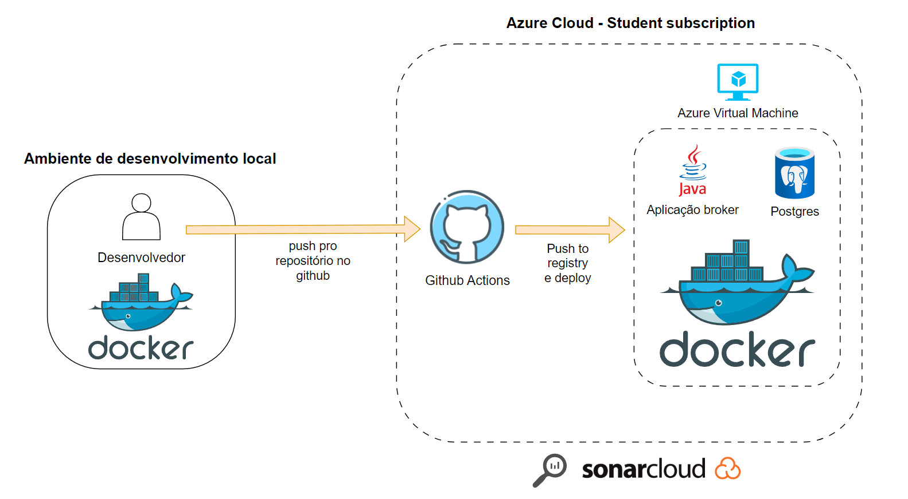
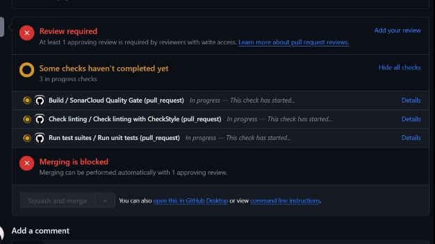
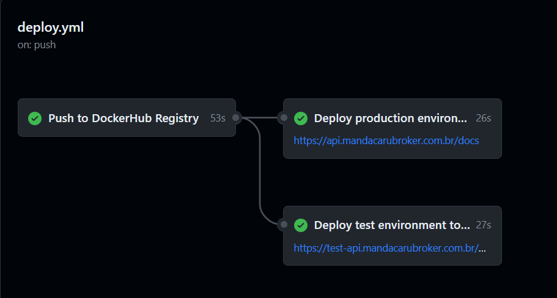

<h1 align="center"></h1>

  <strong>Projeto vencedor do <a href="https://mandacaru.dev">Mandacaru.dev</a> no Módulo Jandaia</strong>

O projeto Mandacaru Broker API é uma aplicação Spring Boot que visa simular o comportamento de um Home Broker de Ações.

## Arquitetura da Solução

## Fluxo de Trabalho

Para ambiente de desenvolvimento, foi utilizado um ambiente local com dois bancos instanciados por meio do `docker-compose.yml`.

Ao realizar a abertura de um pull request, o GitHub Actions é usado para rodar uma pipeline composta por build da aplicação, SonarCloud Quality Gate, checagem de padrão de linting com CheckStyle e execução de testes unitários e de integração.

  

Passado nas checagens do pull request e feitas as revisões pelos membros da equipe, pode ser feito o merge do pull request. Novamente, é executado uma assessment de qualidade com o SonarCloud e é feita a implantação da aplicação utilizando ferramentas em nuvem (**AZURE**) e um workflow de deploy.

Nesse sentido, o workflow de deploy faz o build da imagem docker e push para o Docker Hub. Com isso, o GitHub Actions acessa a máquina virtual na Azure e dois containers são implantados.

  

O primeiro container é referente ao nosso ambiente de **produção**, que foi utilizado para desmonstração no DEMO DAY (09/03/2024): com  [nossa documentação Swagger - ambiente de produção](https://api.mandacarubroker.com.br/docs).

Já o outro container foi do nosso ambiente de **testes**, utilizado para a avaliação do projeto. Esse ambiente foi utilizado como uma alternativa de rodar localmente a aplicação ou usar o ambiente de produção: [nossa documentação swagger - ambiente de teste](https://test-api.mandacarubroker.com.br/swagger-ui/index.html).

## Uso

1. Clone o repositório: `git clone https://github.com/izaiasmachado/mandacarubroker.git`
2. Siga o tutorial para [criar seu arquivo `.env` e subir um banco PostgreSQL](./docs/tutorials/setup-postgresql-docker-compose.md)
3. Importe o projeto em sua IDE preferida **(caso use o IntelliJ):** [realize o tutorial para setar variáveis de ambiente](./docs/tutorials/setup-dotenv-variables-intellij.md) e também [configure o CheckStyle](./docs/tutorials/setup-checkstyle-plugin-intellij.md)
4. Execute o aplicativo Spring Boot
5. Acesse a documentação de nossa API em `http://localhost:8080/docs`

## Requisitos

- Java 17 ou superior
- Maven
- Docker (Opcional para subir o banco de dados)

## Tecnologias Utilizadas

- Spring Boot
- JUnit5
- PostgreSQL
- Bcrypt
- Json Web Token
- Swagger OpenAPI

## Contribuições

Contribuições são bem-vindas!

## Equipe

|  <strong>Íris Costa</strong> |  <strong>Izaias Machado</strong> |  <strong>Jonas Fortes</strong> |  <strong>William Lima</strong> |  <strong>Yann Lucca</strong> |
| :---------------------------------------------------------------------------------------------------: | :--------------------------------------------------------------------------------------------------------: | :------------------------------------------------------------------------------------------------------: | :------------------------------------------------------------------------------------------------------: | :-----------------------------------------------------------------------------------------------------: |
|                          [LinkedIn](https://www.linkedin.com/in/costairis/)                           |                           [LinkedIn](https://www.linkedin.com/in/izaiasmachado/)                           |                     [LinkedIn](https://www.linkedin.com/in/jonas-fortes-2138731a3/)                      |                       [LinkedIn](https://www.linkedin.com/in/william-bruno-sales/)                       |                            [LinkedIn](https://linkedin.com/in/yann-miranda)                             |
|                                [GitHub](https://github.com/iriscoxta)                                 |                                 [GitHub](https://github.com/izaiasmachado)                                 |                                [GitHub](https://github.com/JonasFortes12)                                |                                [GitHub](https://github.com/williambrunos)                                |                                  [GitHub](https://github.com/yannluk4)                                  |

## Licença

Este projeto está licenciado sob a [Licença MIT](LICENSE).
